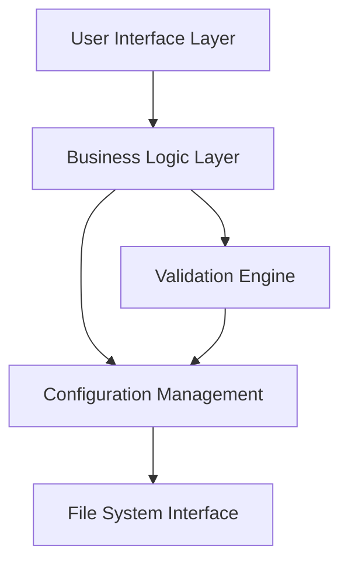

# Design Document

## Overview

The logiops GUI application will be a modern Linux desktop application built using a cross-platform framework that provides native look and feel. The application will serve as a configuration frontend for the logiops daemon (logid), allowing users to create, edit, and manage .cfg configuration files through an intuitive graphical interface.

The application will follow a modular architecture with clear separation between the user interface, configuration parsing/generation, and file management components. It will integrate well with Linux desktop environments and provide a responsive, accessible user experience.

## Architecture

### High-Level Architecture



### Technology Stack

- **Framework**: Electron with React/TypeScript for cross-platform compatibility and modern UI development
- **UI Library**: Material-UI or Ant Design for consistent, modern components
- **Configuration Parsing**: Custom parser for logiops .cfg format
- **File Management**: Node.js fs module with proper error handling
- **Validation**: JSON Schema or custom validation rules based on logiops specifications
- **Build System**: Webpack with electron-builder for packaging

### Alternative Technology Considerations

- **GTK4 with Python**: More native Linux integration but requires Python runtime
- **Qt with C++**: Native performance but more complex development
- **Tauri with Rust**: Smaller footprint but newer ecosystem

Electron is chosen for rapid development, cross-platform compatibility, and rich ecosystem of UI components.

## Components and Interfaces

### 1. Main Application Window

**Purpose**: Primary container for all application functionality

**Key Features**:

- Menu bar with File, Edit, View, Help menus
- Toolbar with common actions (New, Open, Save, Preview)
- Status bar showing current file and validation status
- Responsive layout adapting to window size
- Image of mouse that user can select which buttons do actions

### 2. Device Configuration Panel

**Purpose**: Main interface for configuring device settings

**Sections**:

- Device Selection: Dropdown for selecting target device
- DPI Configuration: Numeric inputs with validation
- Button Mapping: Visual button layout with action assignment
- Gesture Configuration: Gesture direction controls with action mapping
- Scroll Wheel Settings: Mode selection and sensitivity controls

### 3. Configuration Tree View

**Purpose**: Hierarchical view of configuration structure

**Features**:

- Expandable tree showing devices and their settings
- Context menu for adding/removing configuration sections
- Visual indicators for validation errors
- Search functionality for large configurations

### 4. Configuration Preview Panel

**Purpose**: Real-time preview of generated .cfg file

**Features**:

- Syntax-highlighted text display
- Real-time updates as settings change
- Copy to clipboard functionality
- Export options

### 5. File Management Interface

**Purpose**: Handle loading, saving, and managing configuration files

**Components**:

- File dialog integration
- Recent files menu
- Auto-save functionality
- Backup file management

### 6. Validation and Error Display

**Purpose**: Provide real-time feedback on configuration validity

**Features**:

- Inline validation messages
- Error summary panel
- Warning indicators for potential issues
- Suggestions for fixing common problems

## Data Models

### Configuration Data Structure

```typescript
interface LogiopsConfiguration {
  devices: Device[];
  metadata: ConfigurationMetadata;
}

interface Device {
  name: string;
  vid: string; // Vendor ID
  pid: string; // Product ID
  dpi?: DPISettings;
  buttons?: ButtonMapping[];
  gestures?: GestureMapping[];
  scrollWheel?: ScrollWheelSettings;
}

interface DPISettings {
  sensors: DPISensor[];
}

interface DPISensor {
  dpi: number;
  default?: boolean;
}

interface ButtonMapping {
  cid: string; // Control ID
  action: ButtonAction;
}

interface ButtonAction {
  type: "key" | "gesture" | "changeDPI" | "toggleSmartShift";
  parameters?: any;
}

interface GestureMapping {
  direction: "up" | "down" | "left" | "right";
  mode: "OnRelease" | "OnFewPixels" | "OnInterval";
  action: ButtonAction;
}

interface ScrollWheelSettings {
  hires: boolean;
  invert: boolean;
  target: boolean;
}

interface ConfigurationMetadata {
  version: string;
  created: Date;
  modified: Date;
  filename?: string;
}
```

### UI State Management

```typescript
interface ApplicationState {
  currentConfiguration: LogiopsConfiguration;
  isModified: boolean;
  validationErrors: ValidationError[];
  selectedDevice: string | null;
  activePanel: "device" | "preview" | "tree";
  recentFiles: string[];
}

interface ValidationError {
  path: string;
  message: string;
  severity: "error" | "warning";
}
```

## Error Handling

### File Operations

- **File Not Found**: Display user-friendly error with option to browse for file
- **Permission Denied**: Show error with instructions for fixing permissions
- **Corrupted Files**: Attempt partial recovery and show what could be salvaged
- **Disk Full**: Graceful handling with cleanup suggestions

### Configuration Validation

- **Invalid Device IDs**: Suggest common device IDs or provide lookup functionality
- **Out of Range Values**: Show valid ranges and auto-correct when possible
- **Missing Required Fields**: Highlight missing fields and provide defaults
- **Conflicting Settings**: Detect and warn about conflicting configurations

### System Integration

- **Missing logid**: Detect if logid is installed and provide installation guidance
- **Service Status**: Check if logid service is running and offer to start it
- **Permission Issues**: Guide users through setting up proper permissions

## Testing Strategy

### Unit Testing

- **Configuration Parser**: Test parsing of various .cfg file formats
- **Validation Engine**: Test all validation rules with edge cases
- **Data Models**: Test serialization/deserialization of configuration data
- **File Operations**: Mock file system operations and test error conditions

### Integration Testing

- **UI Components**: Test component interactions and state management
- **File Workflow**: Test complete file load/edit/save workflows
- **Configuration Generation**: Test that generated .cfg files work with logid
- **Cross-Platform**: Test on different Linux distributions and desktop environments

### End-to-End Testing

- **User Workflows**: Automate common user scenarios
- **Device Configuration**: Test configuration of actual devices when available
- **File Compatibility**: Test with existing .cfg files from the community
- **Performance**: Test with large configuration files and multiple devices

### Manual Testing

- **Usability**: Test with users unfamiliar with logiops
- **Accessibility**: Test with screen readers and keyboard navigation
- **Visual Design**: Test on different screen sizes and themes
- **Documentation**: Verify help content and tooltips are accurate

## Security Considerations

### File System Access

- Validate all file paths to prevent directory traversal
- Implement proper file permissions checking
- Sanitize file names and content before processing

### Configuration Validation

- Prevent injection attacks through configuration values
- Validate all numeric inputs for reasonable ranges
- Escape special characters in generated configuration files

### System Integration

- Run with minimal required privileges
- Validate system commands before execution
- Implement secure communication with system services

## Performance Considerations

### Application Startup

- Lazy load non-essential components
- Cache frequently used data
- Optimize initial render time

### Large Configurations

- Implement virtual scrolling for large device lists
- Debounce validation and preview updates
- Use efficient data structures for configuration storage

### File Operations

- Stream large files instead of loading entirely into memory
- Implement background saving to prevent UI blocking
- Cache parsed configurations to avoid re-parsing

## Accessibility

### Keyboard Navigation

- Full keyboard navigation support
- Logical tab order throughout the interface
- Keyboard shortcuts for common actions

### Screen Reader Support

- Proper ARIA labels and descriptions
- Semantic HTML structure
- Announcements for dynamic content changes

### Visual Accessibility

- High contrast mode support
- Scalable fonts and UI elements
- Color-blind friendly color schemes
- Focus indicators for all interactive elements
